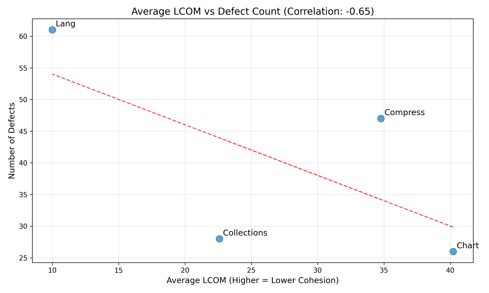
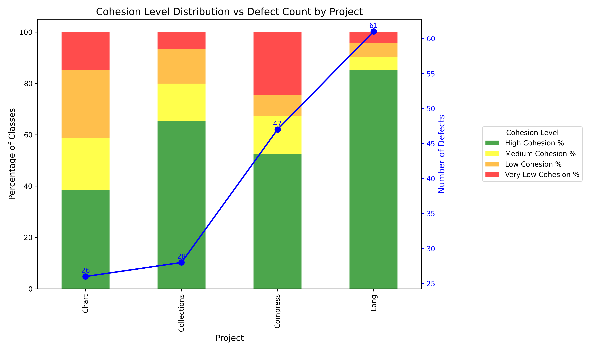
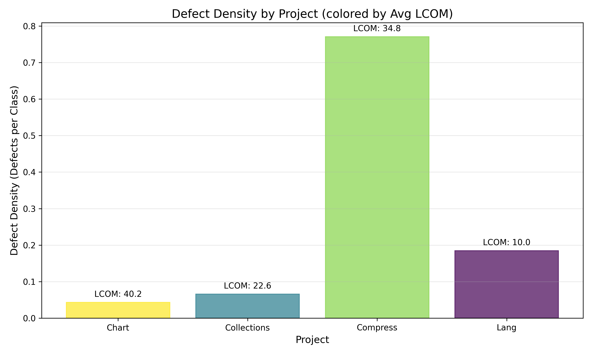

# Results: Analyzing the Relationship Between Code Cohesion and Defects

## 1. Overview

This study investigates the relationship between code cohesion (measured by LCOM - Lack of Cohesion of Methods) and defect counts across four Java projects from the Defects4J dataset. The hypothesis was that "a codebase with low cohesion will have a test suite finding a high amount of defects in the code, as compared to a codebase with high cohesion which will have lower defects."

## 2. Dataset Summary

| Project    | Classes | Defects | Avg LCOM | High Cohesion % | Very Low Cohesion % | Defect Density |
|------------|---------|---------|----------|-----------------|---------------------|----------------|
| Chart      | 602     | 26      | 40.22    | 38.54%          | 14.95%              | 0.043          |
| Collections| 424     | 28      | 22.60    | 65.33%          | 6.60%               | 0.066          |
| Compress   | 61      | 47      | 34.77    | 52.46%          | 24.59%              | 0.770          |
| Lang       | 330     | 61      | 9.99     | 85.15%          | 4.24%               | 0.185          |

*Note: Cohesion levels are categorized as High (LCOM 0-25), Medium (LCOM 25-50), Low (LCOM 50-75), and Very Low (LCOM >75).*

## 3. Key Findings

### 3.1 Correlation Analysis

Our analysis revealed several interesting correlations:

- **Correlation between Avg LCOM and Defects: -0.65**  
  This moderate negative correlation suggests that as LCOM increases (lower cohesion), the number of defects tends to decrease. This contradicts our initial hypothesis.

- **Correlation between High Cohesion % and Defects: 0.72**  
  This strong positive correlation indicates that projects with a higher percentage of high-cohesion classes tend to have more defects, again contradicting our hypothesis.

- **Correlation between Very Low Cohesion % and Defects: -0.11**  
  This weak negative correlation suggests little relationship between the percentage of very low cohesion classes and defect counts.

- **Correlation between Defect Density and Avg LCOM: 0.23**  
  This weak positive correlation suggests that defect density (defects per class) has a slight tendency to increase with higher LCOM values.

### 3.2 Cohesion Distribution vs Defects

The stacked bar chart shows the distribution of cohesion levels across projects, with the defect count overlaid as a line. Key observations:

- Lang has the highest percentage of high-cohesion classes (85.15%) and also the highest defect count (61).
- Compress has the highest defect density (0.77 defects per class) and a relatively high percentage of very low cohesion classes (24.59%).
- Chart has the highest average LCOM (40.22) but a relatively low defect count (26).

### 3.3 Defect Density Analysis

Defect density provides a normalized measure of defects relative to project size:

- Compress has by far the highest defect density (0.77 defects per class), despite not having the highest LCOM.
- Chart has the lowest defect density (0.043 defects per class) despite having the highest average LCOM.
- Lang has a moderate defect density (0.185 defects per class) with the lowest average LCOM.

## 4. Discussion and Interpretation

Our findings challenge the initial hypothesis that lower cohesion (higher LCOM) leads to more defects. In fact, the data suggests a contrary relationship: projects with higher cohesion (lower LCOM) tend to have more defects. However, several factors may explain these counterintuitive results:

### 4.1 Possible Explanations

1. **Testing Intensity**: Projects with higher cohesion might be more actively developed or more thoroughly tested, leading to more discovered defects.

2. **Project Maturity**: More mature projects might have undergone more refactoring to improve cohesion, while simultaneously accumulating a longer history of discovered defects.

3. **Class Complexity**: High-cohesion classes might handle more complex functionality, making them more prone to defects despite their good structure.

4. **LCOM Limitations**: The LCOM metric has known limitations as a measure of cohesion and might not capture all aspects of code quality that influence defect rates.

5. **Small Sample Size**: With only four projects, statistical significance is limited (p-value = 0.3524), and outliers can strongly influence results.

### 4.2 Project-Specific Observations

- **Lang**: Has the highest defect count (61) but the best cohesion metrics (lowest Avg LCOM at 9.99, highest High Cohesion % at 85.15%). This suggests that factors beyond cohesion significantly influence defect counts.

- **Compress**: Has the highest defect density (0.77) and a relatively high percentage of very low cohesion classes (24.59%). This project most closely aligns with our hypothesis.

- **Chart**: Has the highest average LCOM (40.22) but a relatively low defect count and the lowest defect density, contradicting our hypothesis.

- **Collections**: Shows moderate values across most metrics, with no strong patterns supporting or contradicting the hypothesis.

## 5. Limitations

Several limitations should be considered when interpreting these results:

1. **Small Sample Size**: Only four projects were analyzed, limiting statistical power.

2. **Confounding Variables**: Project size, complexity, age, development activity, and testing thoroughness were not controlled for.

3. **Metric Limitations**: LCOM is just one measure of cohesion and may not capture all relevant aspects of code quality.

4. **Defect Reporting Bias**: Projects with more active communities or more thorough testing processes might report more defects regardless of code quality.

5. **Temporal Aspects**: The analysis doesn't account for when defects were introduced relative to code cohesion measurements.

## 6. Conclusion

Our analysis does not support the hypothesis that lower cohesion leads to higher defect counts. In fact, the data suggests a contrary relationship, with higher-cohesion projects showing more defects. However, given the limitations of our study, particularly the small sample size and potential confounding variables, these findings should be interpreted cautiously.

The relationship between code cohesion and defects appears more complex than initially hypothesized. While cohesion remains an important aspect of code quality, its direct impact on defect rates may be overshadowed by other factors such as project complexity, development activity, and testing thoroughness.

Future research should include a larger sample of projects, control for confounding variables, and potentially explore alternative metrics for measuring cohesion and code quality.
